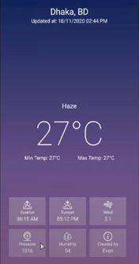
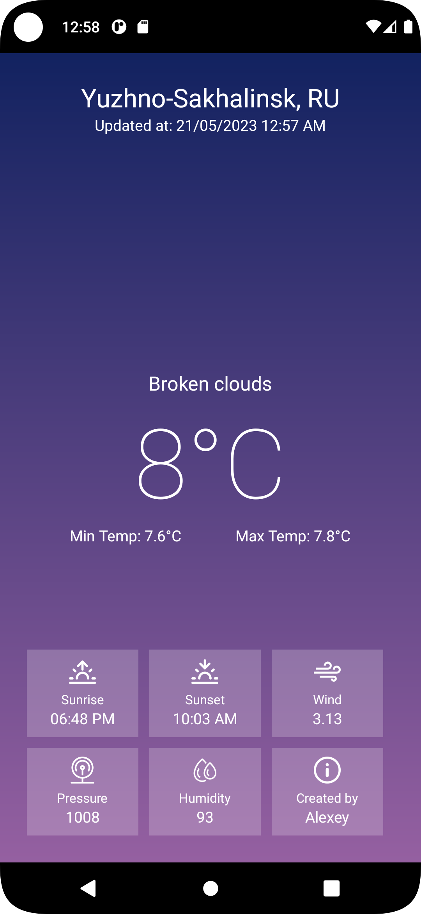

<p align = "center">МИНИСТЕРСТВО НАУКИ И ВЫСШЕГО ОБРАЗОВАНИЯ<br>
РОССИЙСКОЙ ФЕДЕРАЦИИ<br>
ФЕДЕРАЛЬНОЕ ГОСУДАРСТВЕННОЕ БЮДЖЕТНОЕ<br>
ОБРАЗОВАТЕЛЬНОЕ УЧРЕЖДЕНИЕ ВЫСШЕГО ОБРАЗОВАНИЯ<br>
«САХАЛИНСКИЙ ГОСУДАРСТВЕННЫЙ УНИВЕРСИТЕТ»</p>
<br><br><br><br><br><br>
<p align = "center">Институт естественных наук и техносферной безопасности<br>Кафедра информатики<br>Григораш Алексей Владимирович</p>
<br><br><br>
<p align = "center">Лабораторная работа № 11<br><strong>«Приложение погода»
</strong><br>01.03.02 Прикладная математика и информатика</p>
<br><br><br><br><br><br><br><br><br><br><br><br>
<p align = "right">Научный руководитель<br>
Соболев Евгений Игоревич</p>
<br><br><br>
<p align = "center">г. Южно-Сахалинск<br>2023 г.</p>
<br><br><br><br><br><br><br><br>

## Введение:
**Android Studio** — интегрированная среда разработки производства Google, с помощью которой разработчикам становятся доступны инструменты для создания приложений на платформе Android OS


## Задачи:

1.	Реализовать приложение по макету, материалы для макета в архиве lab11.zip.

<div align="center">
    
</div>

2.	Реализовать с помощью https://openweathermap.org/api, заполнение данными, город назначения выбирайте самостоятельно.
## Решение:

<div align="center">
    
</div>

MainActivity.kt:
```kt

package com.example.weather

import android.annotation.SuppressLint
import android.net.ConnectivityManager
import androidx.appcompat.app.AppCompatActivity
import android.os.Bundle
import android.widget.TextView
import java.text.SimpleDateFormat
import java.util.*
import java.net.URL
import java.lang.Math.round
import android.content.*
import android.widget.*
import okhttp3.*
import org.json.JSONObject as JSONObject1


const val API = "01e7384c5892ef4db828a06686d09d94"
const val CITY = "Yuzhno-Sakhalinsk, ru"

class MainActivity : AppCompatActivity() {

    private lateinit var locationTextView: TextView
    private lateinit var updateTextView: TextView
    private lateinit var statusTextView: TextView
    private lateinit var temperatureTextView: TextView
    private lateinit var minTempTextView: TextView
    private lateinit var maxTempTextView: TextView
    private lateinit var sunriseTextView: TextView
    private lateinit var sunsetTextView: TextView
    private lateinit var windTextView: TextView
    private lateinit var pressureTextView: TextView
    private lateinit var humidityTextView: TextView

    override fun onCreate(savedInstanceState: Bundle?) {
        super.onCreate(savedInstanceState)
        setContentView(R.layout.activity_main)

        locationTextView = findViewById(R.id.location)
        updateTextView = findViewById(R.id.update_at)
        statusTextView = findViewById(R.id.status)
        temperatureTextView = findViewById(R.id.temp)
        minTempTextView = findViewById(R.id.tempMin)
        maxTempTextView = findViewById(R.id.tempMax)
        sunriseTextView = findViewById(R.id.sunrise)
        sunsetTextView = findViewById(R.id.sunset)
        windTextView = findViewById(R.id.wind)
        pressureTextView = findViewById(R.id.pressure)
        humidityTextView = findViewById(R.id.humidity)

        doWeather()

    }

    @SuppressLint("SetTextI18n", "SimpleDateFormat")
    private fun doWeather(){

        val url="https://api.openweathermap.org/data/2.5/weather?q=$CITY&APPID=$API"
        val client = OkHttpClient()
        val request = Request.Builder().url(url).build()

        Thread {
            val json = client.newCall(request).execute()
                .use { response -> JSONObject1(response.body()!!.string()) }

            if (json.has("cod") && json.has("message")) {
                runOnUiThread() {
                    Toast.makeText(this, json.getString("message"), Toast.LENGTH_LONG).show()
                }
            }
            else {
                val main = json.getJSONObject("main")
                val sys = json.getJSONObject("sys")
                val address = json.getString("name") + ", " + sys.getString("country")
                val weather = json.getJSONArray("weather").getJSONObject(0)
                val wind = json.getJSONObject("wind")
                val updatedAtText = "Updated at: " + SimpleDateFormat("dd/MM/yyyy hh:mm a").format(Date())

                val temp = round((main.getString("temp").toFloat() - 273.15f))
                val tempMin = round((main.getString("temp_min").toFloat() - 273.15) * 10.0) / 10.0
                val tempMax = round((main.getString("temp_max").toFloat() - 273.15) * 10.0) / 10.0

                val pressure = main.getString("pressure")
                val humidity = main.getString("humidity")
                val sunrise:Long = sys.getLong("sunrise")
                val sunset:Long = sys.getLong("sunset")
                val windSpeed = wind.getString("speed")
                val weatherDescription = weather.getString("description")

                runOnUiThread {
                    locationTextView.text = address
                    updateTextView.text = updatedAtText
                    statusTextView.text = weatherDescription.capitalize(Locale.ROOT)
                    temperatureTextView.text = "$temp°C"
                    minTempTextView.text = "Min Temp: $tempMin°C"
                    maxTempTextView.text = "Max Temp: $tempMax°C"
                    sunriseTextView.text = SimpleDateFormat("hh:mm a").format(Date(sunrise * 1000))
                    sunsetTextView.text = SimpleDateFormat("hh:mm a").format(Date(sunset * 1000))
                    windTextView.text = windSpeed
                    pressureTextView.text = pressure
                    humidityTextView.text = humidity
                }
            }

        }.start()

    }


}

```
## Вывод:
В ходе выполнения задач изучил  заполнение данными с помощью API